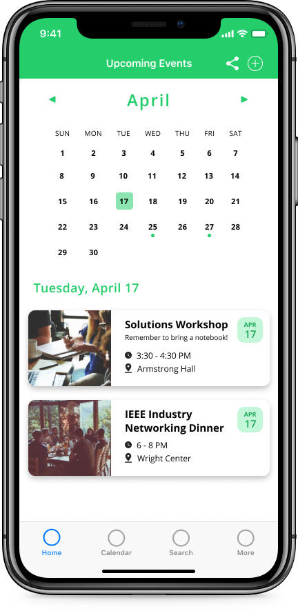
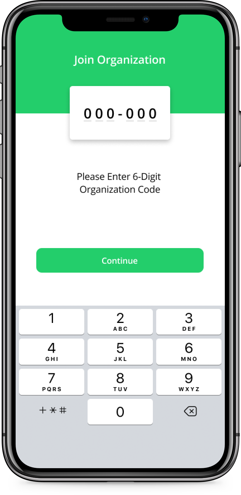
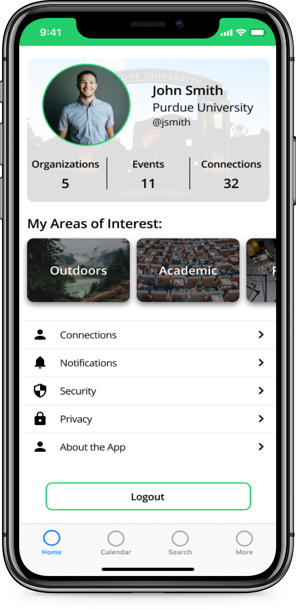
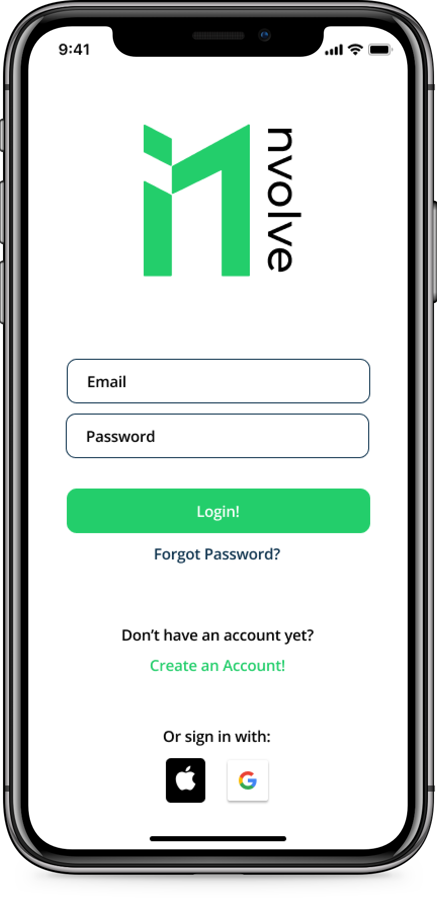

# nvolve: Campus Clubs and Events Discovery 
&copy; 2020 Charles Pisciotta and Prem Bhanderi

This is an overview of the mobile app project that Charles Pisciotta and Prem Bhanderi have recently been working on. To begin, this app is intended to be used at Purdue University and then quickly adopted at other universities. This mobile app is currently in development and already has a significant number of features outlined below.

Notice: This document is for informational purposes only.

---

---

## Table of Contents

1. [About the App](#about-the-app)
    1. [Description](#description)
    2. [Why Campus Involvement Matters](#why-campus-involvement-matters)
    3. [Value Proposition](#value-proposition)
2. [Team](#team)
    - [Charles Pisciotta](#charles-pisciotta)
    - [Prem Bhanderi](#prem-bhanderi)
    - [Brett Weyer](#brett-weyer)
3. [Features](#features)
    1. [Discover Organizations](#discover-organizations)
    2. [Discover Events](#discover-events)
    3. [Subscribe to Organizations](#subscribe-to-organizations)
    4. [Subscribe to Events](#subscribe-to-events)
    5. [Manage Organizations](#manage-organizations)
    6. [Manage Events](#manage-events)
    7. [Connect with Others](#connect-with-others)
    8. [Supporting Features](#supporting-features)
4. [Phases](#phases)
    1. [Phase 1: Organizations](#phase-1-organizations)
    2. [Phase 2: Events](#phase-2-events)
    3. [Phase 3: Attendance](#phase-3-attendance)
    4. [Phase 4: Suggestions](#phase-4-suggestions)
    5. [Phase 5: Planning](#phase-5-planning)
    6. [Phase 6: Connect With Others](#phase-6-connect-with-others)
    7. [Phase 7: Interviews](#phase-7-interviews)
    8. [Phase 8: Social Feed](#phase-8-social-feed)
5. [Third Party Frameworks, Packages, and Tools](#third-party-frameworks-packages-and-tools)
    1. [Shared](#shared)
    2. [iOS](#ios)
    3. [Android](#android)
6. [UI Design](#ui-design)
    - [Color Palette](#color-palette)
7. [Other](#other)
    1. [FAQ](#faq)

---

## About the App

### Description

Students will be able to quickly and easily find organizations and events on campus, allowing them to be more involved and connected on their campus. Organization officers will be better equipped to run their organizations, allowing them to focus on member retention, member satisfaction, and hosting better events.

### Why Campus Involvement Matters

- Exploring Career Interests
- Build Relationships on Campus
- Build Professional Skills
- Campus Involvement Leads to Better Performance in School

### Value Proposition
#### Students

- Know what clubs are on campus
- Stay up to date with latest events
- Become more involved on campus
- Subscribe to multiple clubs
- Receive reminders about meetings

#### Organizations

- Send announcements to club members
- Track member attendance
- Recruit new members
- Upload club information and materials

---

## Team

### **Charles Pisciotta**

Computer Engineering | Honors College - Purdue University | Class of 2022

Charles Pisciotta is currently a rising junior at Purdue University studying computer engineering. Some of his interests include mobile development, technology consulting, and the investment banking industry. As a freshman at Purdue University, he was a member of a hackathon team that placed 3rd at Purdue's 2018 BoilerMake event. That product is now patent-pending and received recognition for its use of Google Cloud. His work experience includes an internship as a Mobile Applications Developer Intern and works as a freelance iOS developer.

 

- Email: [charles.pisciotta1@gmail.com](mailto:charles.pisciotta1@gmail.com)
- GitHub: [cpisciotta](https://github.com/cpisciotta)
- LinkedIn: [charlespisciotta](https://www.linkedin.com/in/charlespisciotta/)
- Website: [charlespisciotta.com](https://www.charlespisciotta.com)

 

### **Prem Bhanderi**

Computer Engineering | Purdue University | Class of 2022

  

Email: prem.bh2@gmail.com 
GitHub: [leven9leven](https://github.com/leven9leven) 
LinkedIn: [prem-bhanderi-270607186](https://www.linkedin.com/in/prem-bhanderi-270607186/)

 

### **Brett Weyer**

B.S. Computer Engineering | Honors College - Purdue University | Class of 2022

 

- Email: [brettweyer@gmail.com](mailto:brettweyer@gmail.com)
- GitHub: [Bweyer6](https://github.com/Bweyer6)
- LinkedIn: [brett-weyer](https://www.linkedin.com/in/brett-weyer/)

---

## Features

> ### Discover Organizations
    
    - Search for Organizations by Category
    - Search for Organizations by Name
    - Receive Suggestions
    - Add Organizations by QR Code or 6 Character Unique Identifier

> ### Discover Events

    - Search for Events by Category
    - Search for Events by Name
    - Receive Suggestions
    - Add Events by QR Code or 6 Character Unique Identifier

> ### Subscribe to Organizations

    - Receive Important Announcements
    - View and Export Upcoming Events
    - View and Share Organization Information

> ### Subscribe to Events

    - Receive Event Reminders
    - View and Export Upcoming Events
    - View and Share Event Information

> ### Manage Organizations

    - Recruit New Members
    - Send Announcements to Members
    - Track Member Attendance
    - Track Organization Growth
    - Plan Regular and Special Meetings
    - Upload Organization Information

> ### Manage Events

    - Send Announcements to Interested Users
    - Track Event Attendance
    - Plan Event Details
    - Upload Event Details

> ### Connect with Others

    - Connect with Members in Your Organization
    - Discover Other Organizations that Connected Members are in
    - Contact Others whom you are Connnected with

> ### Supporting Features

    - Built-In Calendar to View Upcoming Meetings and Events
    - Ability to Use Specific On-Campus Locations for Meetings and Events
    - Ability to Send Feeback In-App
    - Ability to Validate Users via University Credentials
    - Ability to Use University Credentials
    - Ability to Sign In with Google or Apple Credentials
    - Apple Calendar and/or Google Calendar Integration
    - Ability to Receive Email or Text Notifications or Updates
    - A Branded QR Code can be Added to Flyers for Students to Quickly Add Events and Organizations
    - Ability for Leaders to Generate Generic PDF Flyer for Events Registered in the App
    - Tutorial and Help Section to Quickly Solve Common Issues
    

---

## Phases

### Phase 1: Organizations

#### Phase 1A: Basic Organizations Features

    - All Users can Create an Account
    - All Users can Login
    - All Users can Reset Password
    - Organization Leaders can Upload Organization Information
    - All Users can View Organization Information
    - All Users can Receive Organization Event Push/Email Notifications
    - All Users can Select Categories of Interest to Filter Potential Organizations
    - Organization Leaders can Send Manual Announcements to Organization Members
    - All Users can View Upcoming Events on a Native Calendar
    
#### Phase 1B: Search and Share Organizations
    
    - All Users can Search for Organizations by Category
    - All Users can Search for Organizations by Name
    - All Users can Share Organization Information
    - Organization Leaders can Send Announcments to Prospective Members
    - All Users can Share Interest in Joining an Organization
    - All Users can Add Organizations by QR Code
    - All Users can Export Organization Events to a Third Party Calendar

### Phase 2: Events

#### Phase 2A: Basic Event Features

    - Organization Leaders can Create Events
    - Organization Leaders can Upload Event Details
    - All Users can Receive Event Push/Email Notifications
    - All Users can View Upcoming Events
    
#### Phase 2B: Search and Share Events

    - All Users can Search for Events by Category
    - All Users can Search for Events by Name
    - All Users can Share Event Information
    - All Users can Add Events by QR Code
    - All Users can Export Upcoming Events to a Third Party Calendar
    - Organization Leaders can Send Announcements to Prospective Guests

### Phase 3: Attendance

    - Event Hosts can Track Event Attendance
    - All Users can Submit Attendance
    - Organization Leaders can Track Member Attendance
    - All Users can Submit Organization Points
    - All Users can RSVP to Upcoming Organization Events/ Independent Events
    
### Phase 4: Suggestions

    - All Users can Receive Suggestions on which Organizations to Join
    - All Users can Receive Suggestions on which Events to Attend
    
### Phase 5: Planning

    - Event Hosts can Plan Event Details
    - Event Hosts can Upload and Share Event Details
    - Organization Leaders can Plan Meeting Details
    - Organization Leaders can Upload and Share Meeting Details
    - Organization Leaders can Track Organization Growth
    
### Phase 6: Connect With Others

    - All Users can Search for Members
    - Organization Leaders can Recruit New Members
    - All Users can Connect with Members in their Organization
    - All Users can Connect with Members in other Organizations
    - All Users can Discover what Organizations their Connections are in
    
### Phase 7: Interviews

    - Organization Leaders can Set Up Interviews with Prospective Members
    - Organization Leaders can Send Interview Feedback
    
### Phase 8: Social Feed

    - All Users can Message Other Members
    - Organization Leaders can Share What their Organization is Doing with All Users

---

## Third Party Frameworks, Packages, and Tools

### Shared

- [Firebase](https://firebase.google.com)
- [Toggl Plan](https://plan.toggl.com/)
- [Fastlane](https://fastlane.tools)
- [GitHub Actions](https://github.com/features/actions)

### iOS

- [SwiftLint](https://github.com/realm/SwiftLint)
- [SwiftFormat](https://github.com/nicklockwood/SwiftFormat)
- [Jazzy Docs](https://github.com/realm/jazzy)

### Android

- [ktlint](https://ktlint.github.io/#getting-started)

---

## UI Design

### Color Palette

White             |  Outer Space             |  UFO Green             |  Prussian Blue             |  Dodger Blue
:-------------------------:|:-------------------------:|:-------------------------:|:-------------------------:|:-------------------------:
  |    |    |    |  

---

## Other

### FAQ

> **How did this idea come about?**

When trying to find ways to get involved on campus, we found it extremely difficult to get connected with organizations related to our interests. We hope this app streamlines the process of discovering clubs and events on campuses across the country.

> **What about future prospective students? Can they access the app?**

Yes, absolutely. Prospective university and high school students will be able to login as a guest to view what clubs and events are at a specific institution. This very could help them make a decision about what school he or she attends.

> **What platforms are supported?**

Both iOS and Android will be supported. Future support for Web may be added later.

> **What languages are supported?**

English is currently the only supported language, however, we understand the importance of multilingual support and will quickly add the languages which we believe have the broadest reach on campuses.

> **How do students create an account and login? Can they use their institution credentials?**

Yes. Any user can login through the app's custom credentials. Alternatively, every user can use sign in with his or her Google or Apple credentials. If an institution wishes to support their credentials, those credentials might also be supported in the future.

> **How does the app validate organizations, organization leaders, and students?**

Every organization leader or event host will receive a unique code to redeem admin privileges for an organization. Organizations can be flagged by students if it does not exist. In addition, students will likely use their institution login or email to use the app.

> **What about Greek Life? Is that considered an organization?**

Yes. This app will be a great way for Greek Life to promote rush events and to host their own internal events.

> **How do you help organization leaders and event hosts upload information?**

There is an easy to use submission form within the app that an organization leader or event host can use to submit information for others to see.

> **Is this only for universities? What about high schools?**

This app will be targeted to both high schools and universities.

> **How do we incentivize organizations to use the app?**

One way in which institutions might incentivize organizations to update the app and to use it would be to qualify for grants and funding. Ensuring that all organizations on campus continuously update their page will allow prospective and current students to best understand the ways to become involved on campus.

---
